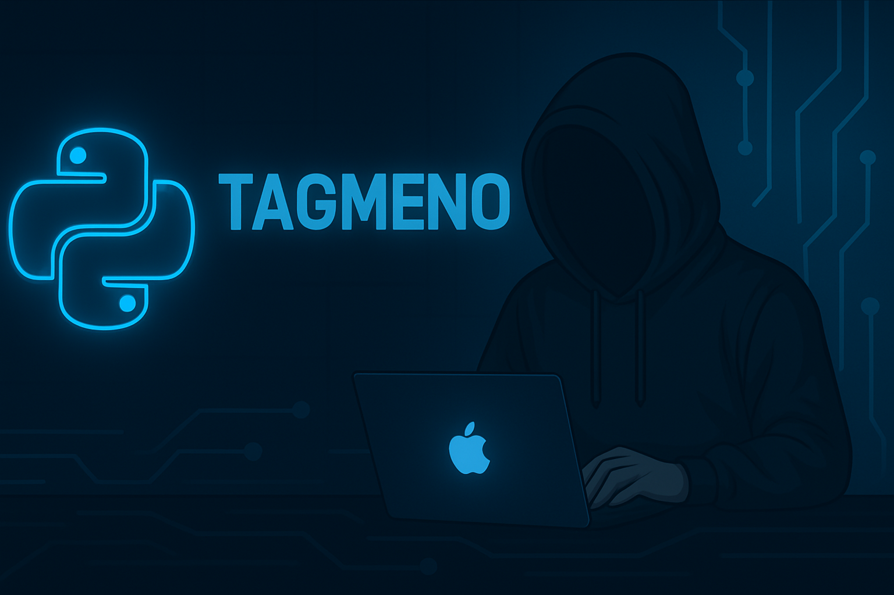

<h1 align="center">👋 Привет! Я Роман — Python Backend Developer</h1>
<h3 align="center">Создаю Telegram-ботов, WebApp (Mini Apps) и backend-сервисы | Tagmeno</h3>

  

---

## 🚀 О себе
Я — Python Backend Developer, специализирующийся на создании веб-сервисов, Telegram-ботов и интеграций.  
Работаю с FastAPI, Django, SQLAlchemy, Aiogram, Pydantic и современным стеком для асинхронной разработки.  
Умею проектировать архитектуру API, реализовывать авторизацию, кеширование, очереди (Redis/Celery) и настраивать деплой.

Технологий много, но главное — я умею доводить проекты до результата.

📍 Москва | Удалённо  
💬 Telegram: **@tagmeno**  
💻 GitHub: **cLoud288**

---

## 🧩 Технологический стек

### 🐍 Backend

### 🗄️ Базы данных

### ⚡ Асинхронность & очереди

### 🔌 Интеграции

### 🐳 DevOps

---

## 📌 Избранные проекты

### 🔹 **Crypto-Trade Bot**
Backend + Telegram-бот для торговли криптовалютой.  
Стек: FastAPI, Aiogram 3, MySQL, SQLAlchemy, Alembic, JWT  
👉 https://github.com/cLoud288/crypto-trade-bot

### 🔹 **NFT Parser**
Парсер NFT-коллекций с API и обработкой данных.  
👉 https://github.com/cLoud288/nft-parser

### 🔹 **AutoToken**
CLI-утилита для генерации токенов/ключей.  
👉 https://github.com/cLoud288/autotoken

### 🔹 **Game Bot**
Telegram-игровой бот на асинхронной логике.  
👉 https://github.com/cLoud288/game-bot

---

## 📊 GitHub статистика

  

  

---

## 🤝 Связь
Если нужен Telegram-бот, backend-сервис или Mini App — пишите:  
📬 **@tagmeno**

---

<h3 align="center">✨ Tagmeno — Telegram. Backend. AI.</h3>
